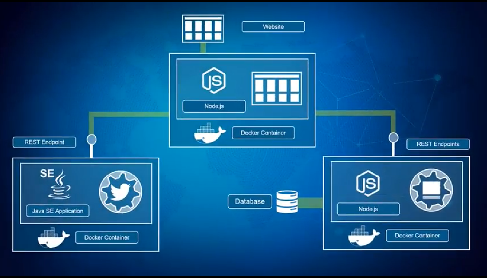
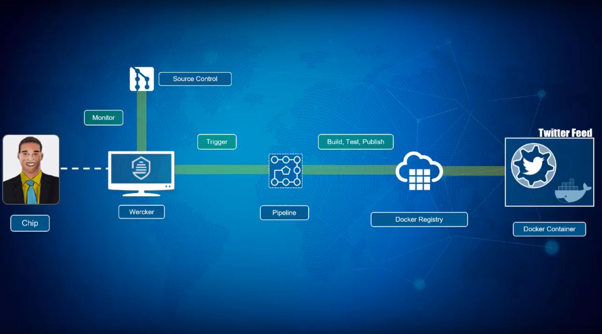
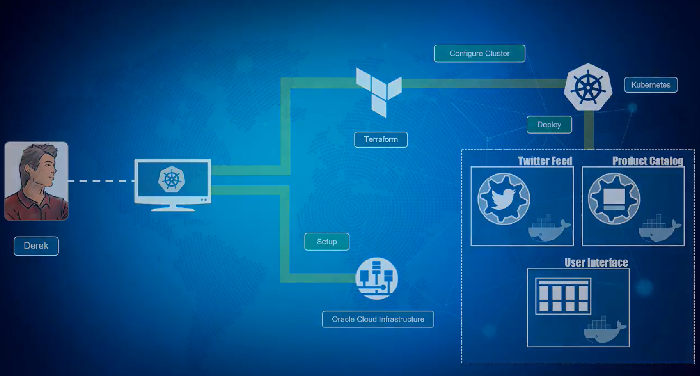
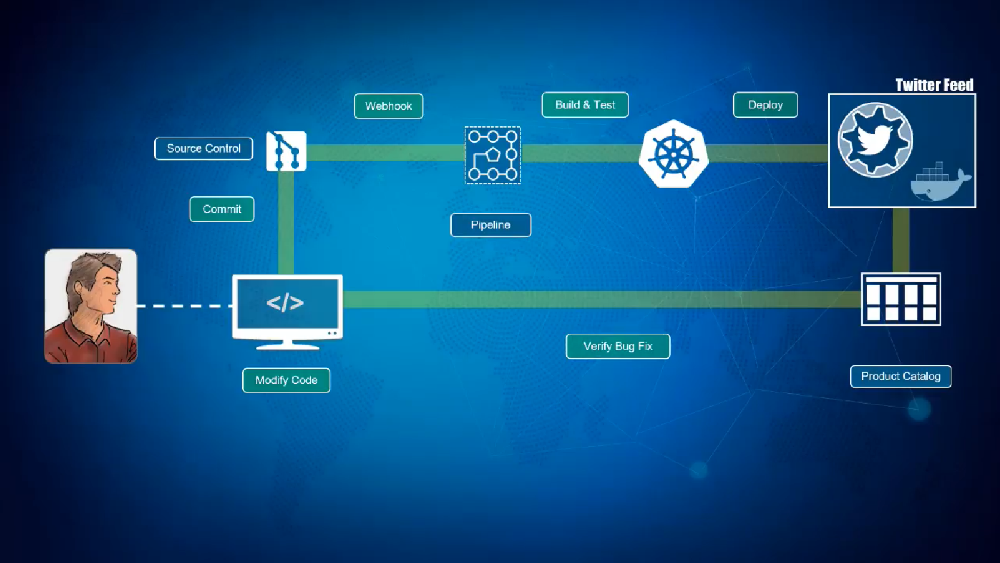
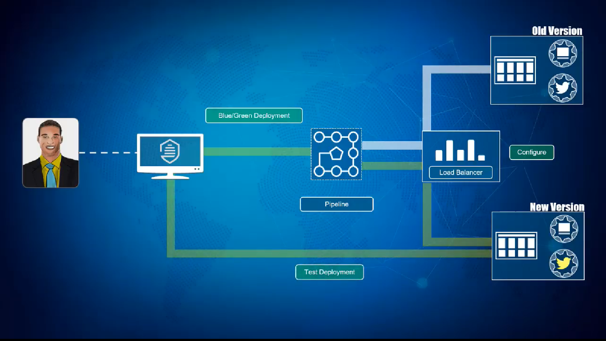
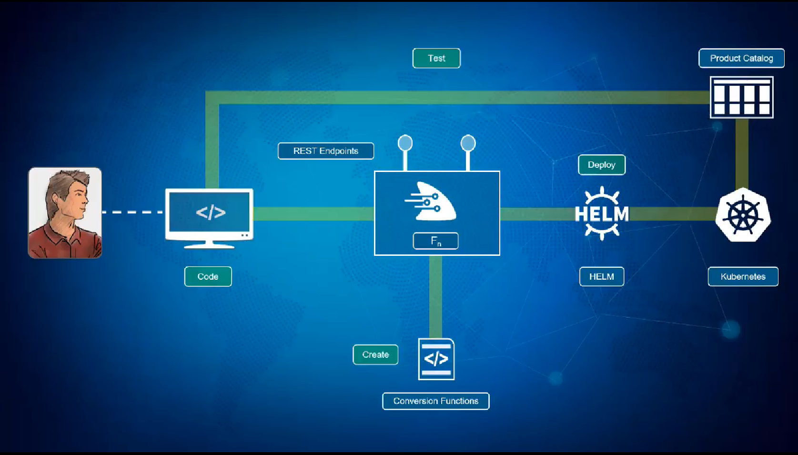
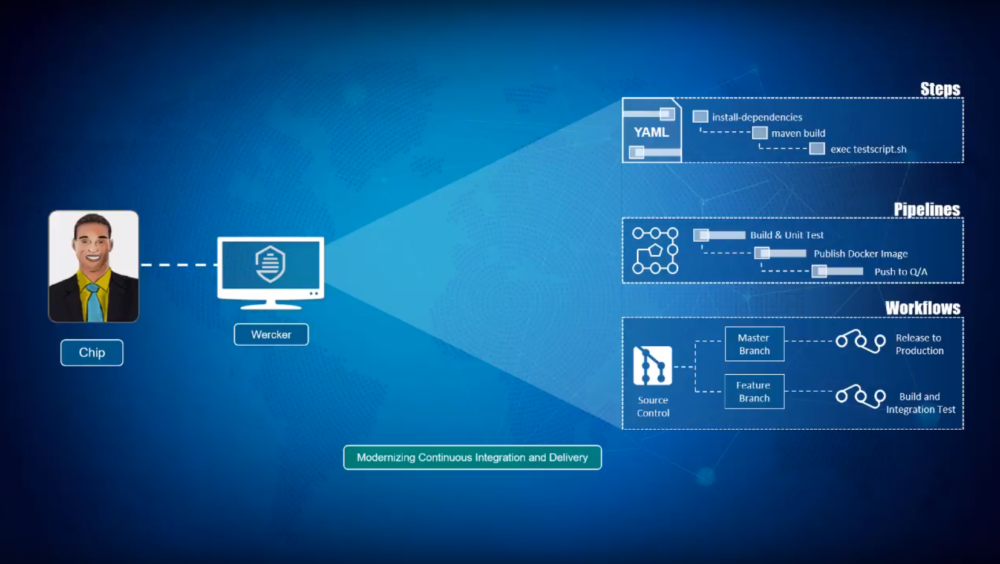

# Description

Welcome to the Oracle Public Cloud Container Native Development workshop. This workshop will walk you through the process of moving an existing application into a containerized CI/CD pipeline and deploying it to a managed Kubernetes service in the Oracle Public Cloud.

## Advantages of Containers for Microservice Architechture

1. Application software is decoupled from host environment. Providing great portability.
2. Containers are lightweight and fairly transparent, enabling scalability.
3. Software is packaged along with its dependencies.
