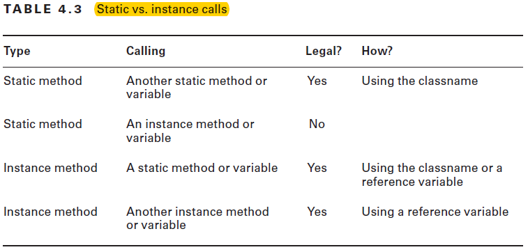
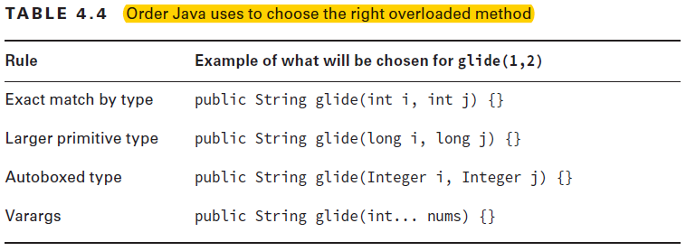

# Methods and Encapsulation

**Use Java Visualizer** or **python tutor** to develop more understanding.

## Designing Methods

- Access Modifiers (4 in total)
  - *public* methods can be called from any class.
  - *private* methods can only be called from within the class.
  - *protected* methods can only be called from classes in the same package or subclasses.(page no 176 for revison)
  - *default* or package private, methods can only be called from classes in the same package.

- Return Type
  - The return type might be an actual Java type such as String or int.
  - If there is no return type, the *void* keyword is used.
  - *Remember that a method must have a return type.*
  - *Methods with a return type other than void are required to have a return statement inside the method body.*
  - Methods that have a return type of void are permitted to have a return statement with no value returned or omit the return        statement entirely.

- Method Name
  - an identifier may only contain letters, numbers, $, or _.
  - the first character is not allowed to be a number, and reserved words are not allowed.

- Parameter List
  - if no parameters then just empty parentheses: ().
  - If multiple parameters, you separate them with a comma.

- Optional Exception List
  - optional
  - can list as many types of exceptions as nedded in this clause separated by commas.

- Method Body
  - A method body is simply a code block.
  - It has braces that contain zero or more Java statements.

## Working with Varargs

A vararg parameter must be the last element in a methods parameter list.
This implies that methods are only allowed to have one vararg parameter per method.
- When calling a method with a *vararg* parameter
  - can pass in an array
  - can pass the list of the elements of the array and let Java create array for you.
  - can even omit the vararg values in the method call and Java will create an array of length zero.

## Applying Access Modifiers

TO-DO: Revise from the book
- private access
- default (package private access)
- protected access
- pubblic access

- Designing Static Methods and Fields
  - Static methods don’t require an instance of the class.
  - static methods have two main purposes:
    - For utility or helper methods that don’t require any object state.
    - *For state* that is shared by all instances of a class, like a counter.

> Does Each Class Have Its Own Copy of the Code?
Each class has a copy of the instance variables. There is only one copy of the code for the instance methods. each call of an instance method (or any method) gets space on the stack for method parameters and local variables.

- Static vs. Instance
  - “member” means field or method
  - *A static member cannot call an instance member.*
  - a static method or instance method can call a static member(method/variable)



- Static Variables
  - we can initialize a static variable on the line it is declared.

- Static Initialization
  - looks like: static{/* code block */}
  - The static initializer runs when the class is first used.
  - final static variable can be initialised only once throght the program, either on declaration or in static block.
  - *Try to Avoid Static and Instance Initializers*
  - There is a common case to use a static initializer: when you need to initialize a static field and the code to do so requires more than one line. This often occurs when you want to initialize a collection like an ArrayList.

- Static Imports
  - Static imports are for importing static members of classes.
  - Syntax : import static java.util.Arrays.asList;
  - Note: if code a method with same signature as static imported one, then JAVA would give preference to the newly coded method in   the class.
  - The compiler will complain if we try to explicitly do a static import of two methods with the same name or two static            variables with the same name.

## Passing Data Among Methods

Java is a “pass-by-value” language. 
This means that a copy of the variable is made and the method receives that copy.
Assignments made in the method do not affect the caller.

## Overloading Methods

Method overloading occurs when there are different method signatures with the same name but different type parameters.
**Everything other than the method signature can vary for overloaded methods.**
This means there can be different access modifiers, specifiers (like static), return types, and exception lists.

- Overloading and Varargs
  - Remember that Java treats varargs as if they were an array.
    - public void fly(int[] lengths) { }
    - public void fly(int... lengths) { } // DOES NOT COMPILE

- Autoboxing
  - what happens if we have both a primitive and an integer version?
     - public void fly(int numMiles) { }
     - public void fly(Integer numMiles) { }
    > Java tries to use the most specific parameter list it can find.

- Reference Types
  - {String, Integer, Double ... etc } cab be promoted to SuperClass Object type such as Object class for matching method to call.

- Primitives
  - Primitives work in a way similar to reference variables. Java tries to find the most specific matching overloaded method.
  - Note that Java can only accept wider types. 
  - An int can be passed to a method taking a long parameter. Java will not automatically convert to a narrower type.



> Note: Java is happy to convert the int 4 to a long 4 or an Integer 4. It cannot handle converting in two steps to a long and then to a Long.

## Creating Constructors

A constructor is a special method that matches the name of the class and has no return type.
- Java is case sensitive, so constructor name should match with class.
- Constructors are used when creating a new object. This process is called instantiation because it creates a new instance of the class.
- When Java sees the *new* keyword, it allocates memory for the new object. eg: new Goal().
- *this* keyword tells Java we want to reference an instance variable.

- Default Constructor
  - If we don’t include any constructors in the class, Java will create one for us without any parameters.
  - This constructor is called as Deafult or No Argument constructor.
  - The default constructor has an empty parameter list and an empty body.
  > Remember that a default constructor is only supplied if there are no constructors present.

- Overloading Constructors

A class can have multiple constructors as long as they have different method signatures.\
Two constructors must have different parameters in order to be overloaded.\
Constructors can be called only by writing new before the name of the constructor.\
this() has one special rule you need to know. If you choose to call it, the this() call must be the first noncommented statement in the constructor.

- Final Fields

**The constructor is part of the initialization process, so it is allowed to assign final instance variables in it.**\
By the time the constructor completes, all final instance variables must have been set.

- Order of Initialization
  1. **If there is a superclass, initialize it first.**
  2. **Static variable declarations and static initializers in the order they appear in the file.**
  3. **Instance variable declarations and instance initializers in the order they appear in the file.**
  4. **The constructor.**

Keep in mind that the four rules apply only if an object is instantiated.\
The other two rules relate to instances and constructors. They have to wait until there is code to instantiate the object.

## Encapsulating Data

accessor/getter \
mutator/setter

For encapsulation, remember that data (an instance variable) is private and getters/setters are public.\
Java defines a naming convention that is used in JavaBeans. 
JavaBeans are reusable software components.
avaBeans call an instance variable a *property*. \


- Creating Immutable Classes

    One step in making a class immutable is to omit the setters. \
    Remember, immutable is only measured after the object is constructed.

## Writing Simple Lambdas

- Only the access modifier or optional specifiers are allowed before the return type.
- optional specifiers are allowed in any order.
- default access does not require a modifier
- Java is case sensitive.
- labels are not allowed for methods.
- *null* requires a reference object as the return type. *void* is not a reference object since it is a marker for no return type.
- a void method is allowed to have a return statement as long as it doesn’t try to return a value.
- two vararg parameters are not allowed in the same method.

```java
public int howMany(boolean b, boolean... b2){
    return b2.length;
}
```

for above code valid call would be:

```java
howMany(true); //valid
howMany(true, true); //valid
howMany(true, true, true); //valid
howMany(true, new boolean[]{true}); //valid
howMany(true, new boolean[]{true, true}); //valid
```

- package private means default.
- if two classes are in different packages, means private access and default (package private) access will not compile.
- if the property is of type boolean and getters must begin with is for booleans. (get/is/set)
- Java allows calling a static method through an instance variable.
- static methods are not allowed to call instance methods.
- instance initializer

```java
{
    System.out.println(rope1.length);
}
```

- static final variables must be set exactly once, and it must be in the declaration line or in a static initialization block.
- you can only do a static import on static members.
- Java is pass-by-value.
- this() may only be called as the first line of a constructor.
- *this.variableName* can be called from any instance method to refer to an instance variable. It cannot be called from a static method because there is no instance of the class to refer to.
- The default constructor is only written by the compiler if no user-defined constructors were provided.
- *this()* can only be called from a constructor in the same class.
- Java prefers autoboxing to varargs. (while promoting the variable. eg. int --> Integer rather than int --> int..)
- return keyword is required inside braces for lambda bodies.
- a variable used in the parameter list of the lambda expression can not be redefined in the lambda body. example:

```java
caller((e) -> {String e = ""; "poof"}); // not valid as e is redefined.
```

**Java uses pass-by-value to copy primitives and references of objects into a method. That means changes to the primitive value or reference in the method are not carried to the calling method. That said, the data within an object can change, just not the original reference itself.**

A constructor can only call this() or super() on the first line of the constructor, but never both in the same constructor. If both constructors were allowed to be called, there would be two separate calls to super(), leading to duplicate initialization of parent constructors, since the other constructor referenced by this() would also call super() (or be chained to one that eventually calls super()).

If a class extends a parent class that does not include a no-argument constructor, the default no-argument constructor cannot be automatically inserted into the child class by the compiler. Instead, the developer must explicitly declare at least one constructor and explicitly define how the call to the parent constructor is made.

A method may contain at most one varargs parameter, and it must appear as the last argument in the list.

*A change made to the data within an object passed to a method is reflected in the calling method.*

> distinction between reference types and object types ?

A static method cannot override a non-static method and vice versa.

Only interfaces and abstract classes can include abstract methods.

Java does not allow multiple inheritance, so having one class extend two interfaces that both define the same default method signature leads to a compiler error, unless the class overrides the method.

example:

    ```java
    package musical;
    interface SpeakDialogue { default int talk() { return 7; } }
    interface SingMonologue { default int talk() { return 5; } }
    public class Performance implements SpeakDialogue, SingMonologue {
    public int talk(String... x) {
        return x.length;
    }
    public static void main(String[] notes) {
        System.out.print(new Performance().talk(notes));
    }
    }
    ```

**In Java, only non-static, non-final, and non-private methods are considered virtual and capable of being overridden in a subclass.**

The *object type* relates to the attributes of the object that exist in memory, while the *reference type* dictates how the object is able to be used by the caller.

The primary motivation for adding default interface methods to Java was for backward compatibility. These methods allow developers to update older classes with a newer version of an interface without breaking functionality in the existing classes.

## Questions from practice for revision

- What is the output of the following application?
    ```java
        package stocks;
        public class Bond {
            private static int price = 5;
            public boolean sell() {
                if(price<10) {
                    price++;
                    return true;
                } else if(price>=10) {
                    return false;
                }
            }
            public static void main(String[] cash) {
                new Bond().sell();
                new Bond().sell();
                new Bond().sell();
                System.out.print(price);
            }
        }
    ```
  - Option
    - 5
    - 6
    - 8
    - The code does not compile.
- What is true about the following program?
    ```java
        package figures;
        public class Dolls {
            public void nested() { nested(2,true); } // g1
            public int nested(int level, boolean height) { return nested(level); }
            public int nested(int level) { return level+1; }; // g2
            public static void main(String[] outOfTheBox) {
                System.out.print(new Dolls().nested());
            }
        }
    ```
  - Options:
    - It compiles successfully and prints 3 at runtime.
    - It does not compile because of line g1.
    - It does not compile because of line g2.
    - It does not compile for some other reason.

- Which of the following statements is not true?
  - An instance of one class may access an instance of another class’s attributes if it has a reference to the instance and the attributes are declared public.
  - An instance of one class may access package-private attributes in a parent class, provided the parent class is not in the same package.
  - Two instances of the same class may access each other’s private attributes.
  - An instance of one class may access an instance of another class’s attributes if both classes are located in the same package and marked protected.

- Given the following class, what should be inserted into the two blanks to ensure the class data is properly encapsulated?
    ```java
        package storage;
        public class Box {
            public String stuff;
                ____________String____________ () {
                return stuff;
            }
            public void setStuff(String stuff) {
                this.stuff = stuff;
            }
        }
    ```
  - Options:
    - public and getStuff
    - private and isStuff
    - public and setStuff
    - None of the above

- Given the following application, which diagram best represents the state of the mySkier, mySpeed, and myName variables in the main() method after the call to the slalom() method?
    ```java
    package slopes;
    public class Ski {
        private int age = 18;
        private static void slalom(Ski racer, int[] speed, String name) {
            racer.age = 18;
            name = "Wendy";
            speed = new int[1];
            speed[0] = 11;
            racer = null;
        }
        public static void main(String... mountain) {
            final Ski mySkier = new Ski();
            mySkier.age = 16;
            final int[] mySpeed = new int[1];
            final String myName = "Rosie";
            slalom(mySkier,mySpeed,myName);
        }
    }
    ```

- Due to which line code won't compile ?
    ```java
    package sports;
    public class Football {
        public static Long getScore(Long timeRemaining) {
            return 2*timeRemaining; // m1
        }
        public static void main(String[] refs) {
            final int startTime = 4;
            System.out.print(getScore(startTime)); // m2
        }
    }
    ```

- Imagine you are working with another team to build an application. You are developing code that uses a class that the other team has not finished writing yet. Which element of Java would best facilitate this development, allowing easy integration once the other team’s code is complete?
  - An abstract class
  - An interface
  - static methods
  - An access modifier
> For this problem, an interface is the best choice. If the two teams agree on a common interface, one developer can write code that uses the interface, while another developer writes code that implements the interface. Assuming neither team changes the interface, the code can be easily integrated once both teams are done.

- What is the output of the following application?
    ```java
    package vehicles;
    class Automobile {
    private final String drive() { return "Driving vehicle"; }
    }
    class Car extends Automobile {
    protected String drive() { return "Driving car"; }
    }
    public class ElectricCar extends Car {
    public final String drive() { return "Driving electric car"; }
    public static void main(String[] wheels) {
        final Car car = new ElectricCar();
        System.out.print(car.drive());
    }
    }
    ```

- What is the output of the following application?
    ```java
    package track;
        interface Run {
            default void walk() {
                System.out.print("Walking and running!");
            }
        }
        interface Jog {
            default void walk() {
                System.out.print("Walking and jogging!");
            }
        }
        public class Sprint implements Run, Jog {
            public void walk() {
                System.out.print("Sprinting!");
            }
            public static void main() {
                new Sprint().walk();
            }
        }
    ```

- Given that Short and Integer extend Number, what type can be used to fill in the blank in the class below to allow it to compile?
    ```java
    package band;
    interface Horn { public Integer play(); }
    abstract class Woodwind { public Short play() {return 3;} }
    public final class Saxophone extends Woodwind implements Horn {
        public  ___________play() {
            return null;
        }
    }
    ```
- Options:
  - Integer
  - Short
  - Number
  - None of the above

- What is the output of the following application?
    ```java
    package sports;
    abstract class Ball {
    protected final int size;
        public Ball(int size) {
            this.size = size;
        }
    }
    interface Equipment {}
    public class SoccerBall extends Ball implements Equipment {
        public SoccerBall() {
            super(5);
        }
        public Ball get() { return this; }
        public static void main(String[] passes) {
            Equipment equipment = (Equipment)(Ball)new SoccerBall().get();
            System.out.print(((SoccerBall)equipment).size);
        }
    }
    ```