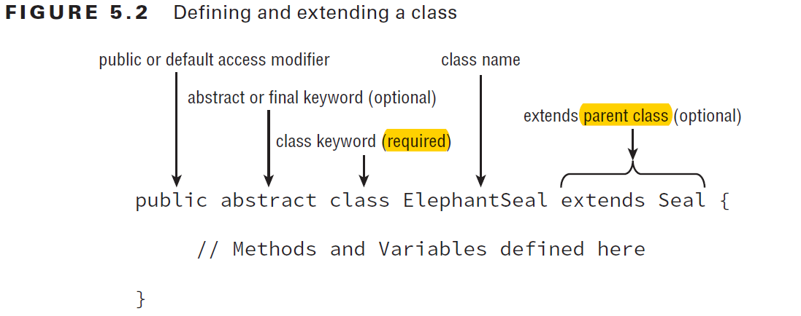

# Class Design

Java class design is about code reusability, increased functionality,and standardization.

## Class

All classes inherit from a single class *java.lang.Object*.

*java.lang.Object* is the only class that doesn’t have any parent classes.

- Class Inheritance
  - Inheritance is the process by which the new child subclass automatically includes any public or protected primitives, objects, or methods defined in the parent class.
  - single inheritance
    - Java supports single inheritance, by which a class may inherit from only one direct parent class.
  - multiple levels of inheritance
    - Java also supports multiple levels of inheritance, by which one class may extend another class, which in turn extends another class.
    - You can extend a class any number of times.
  - Multiple inheritance
    - __By design, Java doesn’t support multiple inheritance in the language because studies have shown that multiple inheritance can lead to complex, often diffi cult-to-maintain code.__
    - Part of what makes multiple inheritance complicated is determining which parent to inherit values from in case of a conflict.
    - Consider: if you have an object or method defined in all of the parents, which one does the child inherit? (Ambiguity)

- Class definition:

- Java allows only one public class per file, a Java file can have many classes but at most one public class.(NOTE: it may have no public class at all)
- There can be at most one public class or *interface* in a Java file.

## Applying Class Access Modifiers

- access modifiers
  - public
    - The public access modifi er applied to a class indicates that it can be referenced and used in any class.
  - private
  - protected
  - default
    - The default package private modifier, which is the lack of any access modifier,indicates the class can be accessed only by a subclass or class within the same package.

- _NOTE_
  - For the OCA exam, you should only be familiar with *public* and *default* package-level class access modifiers, because these are the only ones that can be applied to top-level classes within a Java file.
  - The *protected* and *private* modifiers can only be applied to inner classes, which are classes that are defined within other classes.

## Defining Constructors

Every class has at least one constructor.

In the case that no constructor is declared, the compiler will automatically insert a default no-argument constructor.

In Java, the first statement of every constructor is either a call to another constructor within the class, using *this()*, or a call to a constructor in the direct parent class, using *super()*. If a parent constructor takes arguments, the super constructor would also take arguments.

- _super()_
  - the command may only be used as the first statement of the constructor.

### Understanding Compiler Enhancements

Java compiler automatically inserts a call to the no-argument constructor super() if the first statement is not a call to the parent constructor.

- What happens if the parent class doesn’t have a no-argument constructor?
  - Recall that the no-argument constructor is not required and only inserted if there is no constructor defined in the class.

- Subclasses may define no-argument constructors even if their parent classes do not, provided the constructor of the child maps to a parent constructor via an explicit call of the super() command.

## Calling Constructors

In Java, the parent constructor is always executed before the child constructor.

## Calling Inherited Class Members

Java classes may use any public or protected member of the parent class, including methods, primitives, or object references. If the parent class and child class are part of the same package, the child class may also use any default members defined in the parent class.

__a child class may never access a private member of the parent class, at least not through any direct reference.__

__you can explicitly reference a member of the parent class by using the *super* keyword__

this and super may both be used for methods or variables defined in the parent class, but only this may be used for members defined in the current class.

## Inheriting Methods

Inheriting a class grants us access to the public and protected members of the parent class, but also sets the stage for collisions between methods defined in both the parent class and the subclass.

- Overriding a Method

What if there is a method defined in both the parent and child class?

method signature includes the name and list of input parameters.

__you can override a method a method by declaring a new method with the signature and return type as the method in the parent class.__

When you override a method, you may reference the parent version of the method using the super keyword. In this manner, the keywords this and super allow you to select between the current and parent version of a method, respectively.

- The compiler performs the following checks when you override a nonprivate method:
  1. The method in the child class must have the same signature as the method in the parent class.
  2. The method in the child class must be at least as accessible or more accessible than the method in the parent class.
  3. The method in the child class may not throw a checked exception that is new or broader than the class of any exception thrown in the parent class method.
  4. If the method returns a value, it must be the same or a subclass of the method in the parent class, known as *covariant return types*.

> Any time you see a method on the exam with the same name as a method in the parent class, determine whether the method is being overloaded or overridden first.

- __Redeclaring private Methods__
  - In Java, it is not possible to override a private method in a parent class since the parent method is not accessible from the child class.
  - Java permits you to redeclare a new method in the child class with the same or modified signature as the method in the parent class. This method in the child class is a separate and independent method, unrelated to the parent version’s method, so none of the rules for overriding methods are invoked.

- __Hiding Static Methods__
  - A hidden method occurs when a child class defines a static method with the same name and signature as a static method defined in a parent class.
  - First, *the four previous rules for overriding a method must be followed when a method is hidden*. In addition, *a new rule is added for hiding a method,namely that the usage of the static keyword must be the same between parent and child classes*.
  - In addition to the 4 rules mentioned above:
    - The method defined in the child class must be marked as static if it is marked as static in the parent class (method hiding). Likewise, the method must not be marked as static in the child class if it is not marked as static in the parent class (method overriding).
  - __hiding static methods is fraught with pitfalls and potential problems and as a practice should be avoided.__

- __Overriding vs. Hiding Methods__
  - __At runtime the child version of an overridden method is always executed for an instance regardless of whether the method call is defi ned in a parent or child class method.__
  - __the parent method is never used unless an explicit call to the parent method is referenced, using the syntax ParentClassName.method().__
  - __Alternatively, at runtime the parent version of a hidden method is always executed if the call to the method is defined in the parent class.__

- Creating final methods
  - final methods cannot be overridden.
  - you cannot hide a static method in a parent class if it is marked as final.

- Inheriting Variables
  - __Java doesn’t allow variables to be overridden but instead hidden.__
  - __Don’t Hide Variables in Practice__
  - Hiding Variables
    - the rules for accessing the parent and child variables are:
      - If you’re referencing the variable from within the parent class, the variable defined in the parent class is used. Alternatively,   if you’re referencing the variable from within a child class, the variable defined in the child class is used.

## POINTS TO REMEMBER (Revise before exam)

- Constructor Definition Rules:
  1. The first statement of every constructor is a call to another constructor within the class using this(), or a call to a constructor in the direct parent class using super().
  2. The super() call may not be used after the first statement of the constructor.
  3. If no super() call is declared in a constructor, Java will insert a no-argument super() as the first statement of the constructor.
  4. If the parent doesn’t have a no-argument constructor and the child doesn’t define any constructors, the compiler will throw an error and try to insert a default no-argument.
  5. If the parent doesn’t have a no-argument constructor, the compiler requires an explicit call to a parent constructor in each child constructor.

## for review exam

- All interface methods are implicitly public.
- Prior to Java 8 all interface methods would be assumed to be abstract.Since Java 8 now includes default and static methods and they are never abstract, one cannot assume the abstract modifier will be implicitly applied to all methods by the compiler.
- the rules for overriding a method allow a subclass to define a method with an exception that is a subclass of the exception in the parent method.
- private methods are always hidden in a subclass.
- static methods cannot be overridden, only hidden in subclass.
- variables may only be hidden in subclass, regardless of the access modifier.
- if a method takes the superclass of an object as a parameter, then any subclass references may be used without a cast. (polymorphic parameters)
- All objects extend java.lang.Object, so if a method takes that type, any valid object, including null, may be passed.
- an interface method that provides a body must be marked as default or static explicitly.
- Since Java 8, interfaces may also contain concrete methods in form of static or default methods.
- Both abstract classes and interfaces can be extended with the extends keyword.
- Only interfaces can contain default methods.
- Both abstract classes and interfaces can contain static methods.
- *interface doesn't inherit from java.lang.Object*.
- Interface variables are assumed to be public static final.
- Concrete classes are, by definition, not abstract.
- Concrete classes can be both final and not final.
- Abstract methods cannot contain a body.
- With hidden methods, the specific method used depends on where it is referenced.